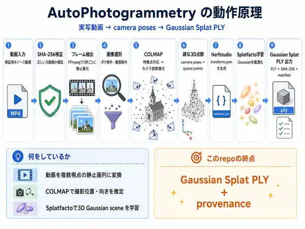

# AutoPhotogrammetry

[](https://github.com/KAFKA2306/AutoPhotogrammetry/actions/workflows/test.yml)



**実写動画 → camera poses → Gaussian Splat PLY** を1タスクで再現します。

## Run

ローカルの責務は **RUNするだけ**です。

```bash
./task run
```

初回だけcloneします。

```bash
git clone https://github.com/KAFKA2306/AutoPhotogrammetry.git
cd AutoPhotogrammetry
./task run
```

環境確認、Docker image build、入力取得、hash検証、frame抽出、COLMAP、Splatfacto、PLY export、成功判定は `./task run` が行います。

実行入口: [`task`](https://github.com/KAFKA2306/AutoPhotogrammetry/blob/main/task)  
GPU環境: [`Dockerfile`](https://github.com/KAFKA2306/AutoPhotogrammetry/blob/main/Dockerfile)  
E2E実装: [`processing/huejotzingo.py`](https://github.com/KAFKA2306/AutoPhotogrammetry/blob/main/processing/huejotzingo.py)

## Pipeline

```text
video
  -> SHA-256 verification
  -> FFmpeg frame extraction
  -> blur / duplicate filtering
  -> COLMAP camera poses
  -> Nerfstudio ns-process-data
  -> Splatfacto training
  -> Gaussian Splat PLY
  -> manifest
```

- [FFmpeg](https://ffmpeg.org/)
- [COLMAP CLI](https://colmap.github.io/cli.html)
- [Nerfstudio custom data](https://docs.nerf.studio/quickstart/custom_dataset.html)
- [Nerfstudio Splatfacto](https://docs.nerf.studio/nerfology/methods/splat.html)
- [Nerfstudio export](https://docs.nerf.studio/reference/cli/ns_export.html)
- [gsplat](https://github.com/nerfstudio-project/gsplat)

## Video candidates

候補動画の正本は [`sources/videos.json`](https://github.com/KAFKA2306/AutoPhotogrammetry/blob/main/sources/videos.json) です。現在20候補を一元管理しています。

**metadataだけでは成功点数を付けません。** 評価は実測で進めます。

```text
metadata
  -> preflight
     scene cuts / sharpness / overlap / camera translation
     dynamic pixels / exposure variation
  -> COLMAP
     registration / largest model / submodels / sparse points
     reprojection error / track length
  -> Splatfacto
     train / export / PSNR / SSIM / LPIPS / PLY hash
```

現在のdefaultは `huejotzingo`。ここだけCOLMAPまで実測済みです。

- source: [Wikimedia Commons — Ex Convento de San Miguel Arcángel, Huejotzingo](https://commons.wikimedia.org/wiki/File:Vista_del_Ex_Convento_de_San_Miguel_Arc%C3%A1ngel,_Huejotzingo,_desde_un_dron.webm)
- author: Luisalvaz
- license: CC0 1.0
- duration: 232.766 s
- local input: 1920×1080 VP9 transcode
- SHA-256: `c9723df1af171d40a5bf1f9530aa3ea881c6f95252ef3f2004f0f1013ab92e30`
- COLMAP: **78 / 78 registered**, **1 model**, **32,782 sparse points**, **0.370830 px mean reprojection error**

探索元: [Wikimedia Commons — Drone videos from Mexico](https://commons.wikimedia.org/wiki/Category:Drone_videos_from_Mexico)

## Output

```text
output/huejotzingo/
├── frames/
├── selected/
├── colmap/
├── nerfstudio-data/
├── runs/
└── manifest.json
```

E2E成功条件:

```json
{
  "status": "success",
  "output": {
    "ply_path": "...",
    "ply_sha256": "...",
    "ply_size_bytes": 123456
  }
}
```

PLY hashが得られるまで成功扱いにしません。

## Scope

このrepoの終点は **Gaussian Splat PLY + provenance** です。

PLYのWeb / Unity / VRChat利用は [`KAFKA2306/vrmine`](https://github.com/KAFKA2306/vrmine) が担当します。
